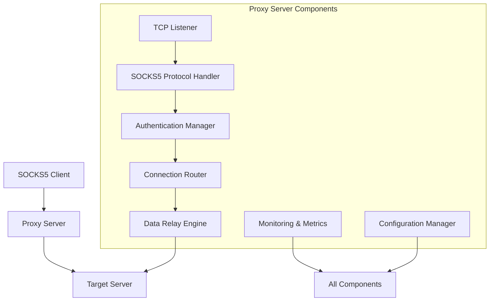
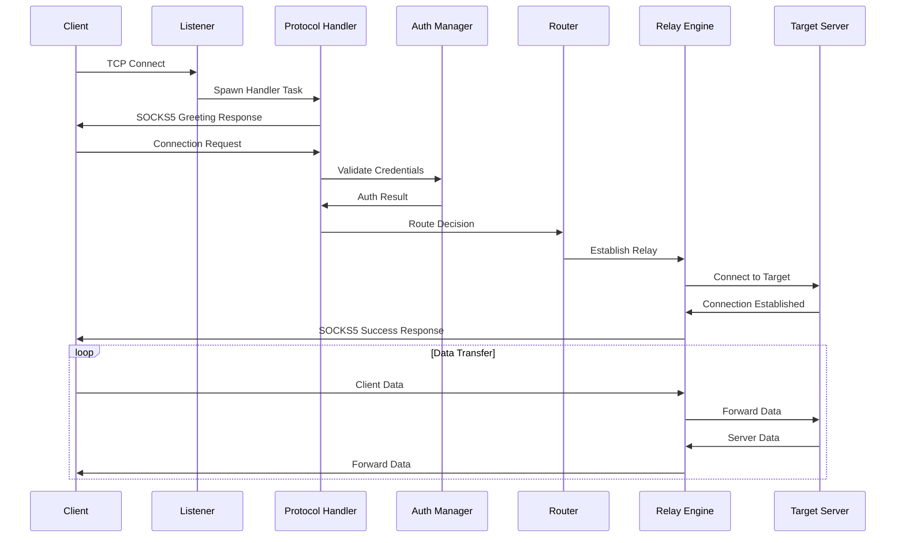

# SOCKS5 Proxy Design Document

## Overview

This document outlines the architectural design for a high-performance SOCKS5 proxy server implemented in Rust. The design leverages Rust's async/await capabilities with Tokio for concurrent connection handling, emphasizes modularity for extensibility, and incorporates security and observability as first-class concerns.

The proxy follows a layered architecture with clear separation between protocol handling, connection management, authentication, routing, and monitoring components. This design enables incremental development from a basic relay to a feature-rich production proxy.

## Architecture

### High-Level Architecture



### Component Interaction Flow



## Components and Interfaces

### 1. TCP Listener and Connection Manager

**Purpose:** Accept incoming connections and manage connection lifecycle.

**Key Interfaces:**
```rust
pub struct ConnectionManager {
    listener: TcpListener,
    config: Arc<Config>,
    metrics: Arc<Metrics>,
}

impl ConnectionManager {
    pub async fn start(&self) -> Result<()>;
    pub async fn handle_connection(&self, stream: TcpStream, addr: SocketAddr);
    pub fn get_active_connections(&self) -> usize;
}
```

**Responsibilities:**
- Bind to configured port and accept connections
- Spawn async tasks for each client connection
- Track active connections and enforce limits
- Implement graceful shutdown handling
- Provide connection statistics

### 2. SOCKS5 Protocol Handler

**Purpose:** Implement the SOCKS5 protocol specification for client communication.

**Key Interfaces:**
```rust
pub struct Socks5Handler {
    stream: TcpStream,
    auth_manager: Arc<AuthManager>,
    router: Arc<Router>,
}

#[derive(Debug)]
pub enum Socks5Command {
    Connect { addr: TargetAddr, port: u16 },
    Bind { addr: TargetAddr, port: u16 },
    UdpAssociate { addr: TargetAddr, port: u16 },
}

#[derive(Debug)]
pub enum TargetAddr {
    Ipv4(Ipv4Addr),
    Ipv6(Ipv6Addr),
    Domain(String),
}

impl Socks5Handler {
    pub async fn handle_handshake(&mut self) -> Result<AuthMethod>;
    pub async fn handle_request(&mut self) -> Result<Socks5Command>;
    pub async fn send_response(&mut self, response: Socks5Response) -> Result<()>;
}
```

**Responsibilities:**
- Parse SOCKS5 greeting and respond with auth method
- Handle authentication negotiation
- Parse connection requests (CONNECT, BIND, UDP_ASSOCIATE)
- Support IPv4, IPv6, and domain name addressing
- Send appropriate response codes

### 3. Authentication Manager

**Purpose:** Handle user authentication and session management.

**Key Interfaces:**
```rust
pub struct AuthManager {
    config: Arc<Config>,
    user_store: Arc<UserStore>,
    session_tracker: Arc<SessionTracker>,
}

#[derive(Debug)]
pub enum AuthMethod {
    NoAuth,
    UserPass,
    Unsupported,
}

#[derive(Debug)]
pub struct AuthResult {
    pub success: bool,
    pub user_id: Option<String>,
    pub session_id: String,
}

impl AuthManager {
    pub async fn authenticate(&self, method: AuthMethod, credentials: &[u8]) -> Result<AuthResult>;
    pub fn validate_user(&self, username: &str, password: &str) -> bool;
    pub fn create_session(&self, user_id: &str) -> String;
}
```

**Responsibilities:**
- Support no-auth and username/password authentication
- Validate credentials against configured user database
- Create and manage user sessions
- Track authentication attempts and implement rate limiting
- Support dynamic user management

### 4. Connection Router and Access Control

**Purpose:** Make routing decisions and enforce access control policies.

**Key Interfaces:**
```rust
pub struct Router {
    config: Arc<Config>,
    acl: Arc<AccessControlList>,
    geoip: Option<Arc<GeoIpDatabase>>,
}

#[derive(Debug)]
pub enum RouteDecision {
    Allow { upstream: Option<UpstreamProxy> },
    Block { reason: String },
    Redirect { target: SocketAddr },
}

#[derive(Debug)]
pub struct UpstreamProxy {
    pub addr: SocketAddr,
    pub auth: Option<ProxyAuth>,
    pub protocol: ProxyProtocol,
}

impl Router {
    pub async fn route_request(&self, target: &TargetAddr, port: u16, user: Option<&str>) -> RouteDecision;
    pub fn check_access(&self, target: &TargetAddr, port: u16, source_ip: IpAddr) -> bool;
    pub async fn resolve_target(&self, addr: &TargetAddr) -> Result<Vec<SocketAddr>>;
}
```

**Responsibilities:**
- Enforce access control lists (IP, domain, port-based)
- Implement GeoIP-based filtering and routing
- Support custom routing rules and policies
- Handle domain name resolution
- Manage upstream proxy chaining

### 5. Data Relay Engine

**Purpose:** Efficiently relay data between client and target connections.

**Key Interfaces:**
```rust
pub struct RelayEngine {
    metrics: Arc<Metrics>,
    config: Arc<Config>,
}

#[derive(Debug)]
pub struct RelaySession {
    pub session_id: String,
    pub client_addr: SocketAddr,
    pub target_addr: SocketAddr,
    pub start_time: Instant,
    pub bytes_up: AtomicU64,
    pub bytes_down: AtomicU64,
}

impl RelayEngine {
    pub async fn start_relay(&self, client: TcpStream, target: TcpStream) -> Result<RelaySession>;
    pub async fn relay_data(&self, session: &RelaySession, client: TcpStream, target: TcpStream) -> Result<()>;
    pub fn get_active_sessions(&self) -> Vec<RelaySession>;
}
```

**Responsibilities:**
- Establish connections to target servers
- Implement bidirectional data relay using `tokio::io::copy_bidirectional`
- Track data transfer statistics
- Handle connection errors and cleanup
- Support connection timeouts and keep-alive

### 6. Configuration Manager

**Purpose:** Handle configuration loading, validation, and hot-reloading.

**Key Interfaces:**
```rust
#[derive(Debug, Clone, Deserialize)]
pub struct Config {
    pub server: ServerConfig,
    pub auth: AuthConfig,
    pub access_control: AccessControlConfig,
    pub routing: RoutingConfig,
    pub monitoring: MonitoringConfig,
}

#[derive(Debug, Clone, Deserialize)]
pub struct ServerConfig {
    pub bind_addr: SocketAddr,
    pub max_connections: usize,
    pub connection_timeout: Duration,
    pub buffer_size: usize,
}

impl Config {
    pub fn load_from_file(path: &Path) -> Result<Self>;
    pub fn load_from_env() -> Result<Self>;
    pub fn validate(&self) -> Result<()>;
    pub fn merge_with_cli_args(&mut self, args: &CliArgs);
}
```

**Responsibilities:**
- Load configuration from TOML/YAML files
- Support environment variable overrides
- Validate configuration parameters
- Enable hot-reloading without restart
- Provide sensible defaults

### 7. Monitoring and Metrics

**Purpose:** Provide observability into proxy operations and performance.

**Key Interfaces:**
```rust
pub struct Metrics {
    connections_total: Counter,
    connections_active: Gauge,
    bytes_transferred: Counter,
    request_duration: Histogram,
    auth_attempts: Counter,
    blocked_requests: Counter,
}

#[derive(Debug)]
pub struct ConnectionStats {
    pub session_id: String,
    pub client_addr: SocketAddr,
    pub target_addr: SocketAddr,
    pub duration: Duration,
    pub bytes_up: u64,
    pub bytes_down: u64,
    pub user_id: Option<String>,
}

impl Metrics {
    pub fn record_connection(&self, stats: &ConnectionStats);
    pub fn increment_auth_attempts(&self, success: bool);
    pub fn record_blocked_request(&self, reason: &str);
    pub fn export_prometheus(&self) -> String;
}
```

**Responsibilities:**
- Collect connection and performance metrics
- Export Prometheus-compatible metrics
- Provide structured logging with tracing
- Track authentication and access control events
- Generate usage reports and statistics

## Data Models

### Core Protocol Types

```rust
// SOCKS5 Protocol Constants
pub const SOCKS5_VERSION: u8 = 0x05;
pub const SOCKS5_CMD_CONNECT: u8 = 0x01;
pub const SOCKS5_CMD_BIND: u8 = 0x02;
pub const SOCKS5_CMD_UDP_ASSOCIATE: u8 = 0x03;

// Address Types
pub const SOCKS5_ADDR_IPV4: u8 = 0x01;
pub const SOCKS5_ADDR_DOMAIN: u8 = 0x03;
pub const SOCKS5_ADDR_IPV6: u8 = 0x04;

// Authentication Methods
pub const SOCKS5_AUTH_NONE: u8 = 0x00;
pub const SOCKS5_AUTH_USERPASS: u8 = 0x02;
pub const SOCKS5_AUTH_UNSUPPORTED: u8 = 0xFF;

// Response Codes
pub const SOCKS5_REPLY_SUCCESS: u8 = 0x00;
pub const SOCKS5_REPLY_GENERAL_FAILURE: u8 = 0x01;
pub const SOCKS5_REPLY_CONNECTION_NOT_ALLOWED: u8 = 0x02;
pub const SOCKS5_REPLY_NETWORK_UNREACHABLE: u8 = 0x03;
pub const SOCKS5_REPLY_HOST_UNREACHABLE: u8 = 0x04;
pub const SOCKS5_REPLY_CONNECTION_REFUSED: u8 = 0x05;
```

### Configuration Schema

```rust
#[derive(Debug, Clone, Deserialize)]
pub struct AccessControlConfig {
    pub enabled: bool,
    pub default_policy: Policy,
    pub rules: Vec<AccessRule>,
    pub geoip_database: Option<PathBuf>,
}

#[derive(Debug, Clone, Deserialize)]
pub struct AccessRule {
    pub pattern: String,
    pub action: Action,
    pub ports: Option<Vec<u16>>,
    pub countries: Option<Vec<String>>,
}

#[derive(Debug, Clone, Deserialize)]
pub enum Policy {
    Allow,
    Block,
}

#[derive(Debug, Clone, Deserialize)]
pub enum Action {
    Allow,
    Block,
    Redirect(SocketAddr),
}
```

## Error Handling

### Error Types and Recovery Strategies

```rust
#[derive(Debug, thiserror::Error)]
pub enum ProxyError {
    #[error("Protocol error: {0}")]
    Protocol(String),
    
    #[error("Authentication failed: {0}")]
    Authentication(String),
    
    #[error("Access denied: {0}")]
    AccessDenied(String),
    
    #[error("Connection error: {0}")]
    Connection(#[from] std::io::Error),
    
    #[error("Configuration error: {0}")]
    Configuration(String),
    
    #[error("Internal error: {0}")]
    Internal(String),
}

pub type Result<T> = std::result::Result<T, ProxyError>;
```

**Error Handling Strategy:**
- Use structured error types with context information
- Implement graceful degradation for non-critical failures
- Log errors with appropriate severity levels
- Return proper SOCKS5 error codes to clients
- Implement circuit breakers for upstream connections
- Provide detailed error messages for debugging

### Resilience Patterns

- **Connection Timeouts:** Implement configurable timeouts for all network operations
- **Rate Limiting:** Use token bucket algorithm for connection rate limiting
- **Circuit Breaker:** Temporarily disable failing upstream proxies
- **Retry Logic:** Implement exponential backoff for transient failures
- **Resource Limits:** Enforce memory and connection limits to prevent resource exhaustion

## Testing Strategy

### Unit Testing

**Protocol Testing:**
- Test SOCKS5 handshake parsing and response generation
- Validate address parsing for IPv4, IPv6, and domain names
- Test authentication method negotiation
- Verify error response generation

**Component Testing:**
- Test authentication manager with various credential scenarios
- Validate access control rule evaluation
- Test configuration loading and validation
- Verify metrics collection and export

### Integration Testing

**End-to-End Testing:**
- Test complete SOCKS5 flows using real clients (curl, browsers)
- Validate data relay functionality with various protocols (HTTP, HTTPS, FTP)
- Test authentication flows with valid and invalid credentials
- Verify access control enforcement

**Performance Testing:**
- Benchmark concurrent connection handling
- Measure data relay throughput and latency
- Test memory usage under load
- Validate graceful handling of connection limits

### Security Testing

**Protocol Security:**
- Test against malformed SOCKS5 packets
- Validate buffer overflow protection
- Test authentication bypass attempts
- Verify access control bypass resistance

**Network Security:**
- Test against connection flooding attacks
- Validate rate limiting effectiveness
- Test upstream proxy security
- Verify TLS encryption when enabled

### Testing Tools and Framework

```rust
// Test utilities for SOCKS5 protocol testing
pub struct Socks5TestClient {
    stream: TcpStream,
}

impl Socks5TestClient {
    pub async fn connect(addr: SocketAddr) -> Result<Self>;
    pub async fn handshake(&mut self, auth_methods: &[u8]) -> Result<u8>;
    pub async fn authenticate(&mut self, username: &str, password: &str) -> Result<bool>;
    pub async fn connect_target(&mut self, target: &str, port: u16) -> Result<()>;
    pub async fn send_data(&mut self, data: &[u8]) -> Result<()>;
    pub async fn receive_data(&mut self) -> Result<Vec<u8>>;
}
```

**Testing Infrastructure:**
- Use `tokio-test` for async testing
- Implement mock target servers for testing
- Create test fixtures for various SOCKS5 scenarios
- Use property-based testing for protocol parsing
- Implement load testing with realistic traffic patterns

This design provides a solid foundation for implementing a production-ready SOCKS5 proxy while maintaining flexibility for future enhancements and ensuring robust error handling and testing coverage.