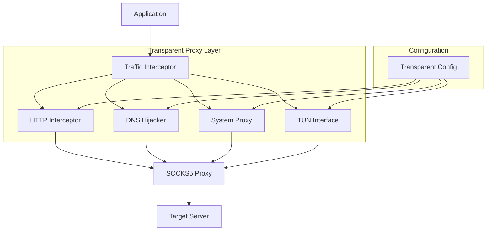

# Transparent Proxy Design

## Overview

The transparent proxy feature extends the existing SOCKS5 proxy with multiple interception methods that make applications completely unaware they're being proxied. The design implements four main approaches: HTTP/HTTPS interception, DNS hijacking, system proxy integration, and TUN/TAP interface support.

The system works by intercepting network traffic at different layers and automatically routing it through the existing SOCKS5 proxy infrastructure, maintaining full compatibility with the current proxy features while adding transparency.

## Architecture



### Core Components

1. **Transparent Proxy Manager**: Central coordinator for all transparent proxy methods
2. **HTTP Interceptor**: Handles HTTP/HTTPS traffic interception and CONNECT tunneling
3. **DNS Hijacker**: Intercepts DNS queries and provides controlled responses
4. **System Proxy Configurator**: Automatically configures OS-level proxy settings
5. **TUN Interface Manager**: Creates and manages virtual network interfaces
6. **Traffic Router**: Routes intercepted traffic through the SOCKS5 proxy

## Components and Interfaces

### TransparentProxy Manager

```rust
pub struct TransparentProxy {
    config: TransparentConfig,
    http_interceptor: Option<HttpInterceptor>,
    dns_hijacker: Option<DnsHijacker>,
    system_proxy: Option<SystemProxy>,
    tun_interface: Option<TunInterface>,
}

impl TransparentProxy {
    pub async fn start(&mut self) -> Result<()>;
    pub async fn stop(&mut self);
    pub fn get_setup_instructions(&self) -> String;
}
```

### HTTP Interceptor

The HTTP interceptor operates as a transparent HTTP/HTTPS proxy:

- **HTTP Mode**: Parses HTTP requests, extracts host/port, connects via SOCKS5
- **HTTPS Mode**: Handles CONNECT requests, establishes SOCKS5 tunnels
- **Bidirectional Relay**: Forwards data between client and SOCKS5 proxy

```rust
pub struct HttpInterceptor {
    http_port: u16,
    https_port: u16,
    socks5_addr: SocketAddr,
    proxy_auth: Option<(String, String)>,
}

impl HttpInterceptor {
    pub async fn start(&self) -> Result<()>;
    pub async fn stop(&self);
    async fn handle_http_request(&self, stream: TcpStream) -> Result<()>;
    async fn handle_https_connect(&self, stream: TcpStream) -> Result<()>;
}
```

### DNS Hijacker

The DNS hijacker intercepts DNS queries and redirects them:

- **Query Interception**: Listens on DNS port (53 or alternative)
- **Response Generation**: Creates DNS responses pointing to interceptor IP
- **Domain Filtering**: Optionally filters which domains to redirect

```rust
pub struct DnsHijacker {
    dns_port: u16,
    redirect_ip: Ipv4Addr,
}

impl DnsHijacker {
    pub async fn start(&self) -> Result<()>;
    pub async fn stop(&self);
    fn create_dns_response(&self, query: &[u8]) -> Result<Vec<u8>>;
}
```

### System Proxy Integration

Platform-specific system proxy configuration:

- **Windows**: Registry modification for Internet Settings
- **macOS**: networksetup command integration
- **Linux**: Environment variables and system configuration

```rust
pub struct SystemProxy {
    config: SystemProxyConfig,
    original_settings: Option<SystemProxySettings>,
}

impl SystemProxy {
    pub async fn enable(&mut self) -> Result<()>;
    pub async fn disable(&mut self) -> Result<()>;
    pub fn get_setup_instructions(&self) -> String;
}
```

### TUN Interface Support

Virtual network interface for complete traffic interception:

- **Interface Creation**: Platform-specific TUN/TAP interface creation
- **Traffic Routing**: Route all traffic through the interface
- **Packet Processing**: Parse and route network packets

```rust
pub struct TunInterface {
    config: TunConfig,
    interface_handle: Option<PlatformHandle>,
}

impl TunInterface {
    pub async fn start(&mut self) -> Result<()>;
    pub async fn stop(&mut self);
    pub fn get_setup_instructions(&self) -> String;
}
```

## Data Models

### Transparent Configuration

```rust
#[derive(Debug, Clone)]
pub struct TransparentConfig {
    // HTTP Interception
    pub http_intercept_enabled: bool,
    pub http_intercept_port: u16,
    pub https_intercept_enabled: bool,
    pub https_intercept_port: u16,
    
    // DNS Hijacking
    pub dns_hijack_enabled: bool,
    pub dns_hijack_port: u16,
    
    // System Proxy
    pub system_proxy_enabled: bool,
    pub bypass_list: Vec<String>,
    
    // TUN Interface
    pub tun_enabled: bool,
    pub tun_interface_name: String,
    pub tun_ip: Ipv4Addr,
    
    // SOCKS5 Backend
    pub socks5_proxy_addr: SocketAddr,
    pub proxy_auth: Option<(String, String)>,
}
```

### Platform-Specific Settings

```rust
#[derive(Debug, Clone)]
pub struct SystemProxySettings {
    #[cfg(target_os = "windows")]
    pub registry_values: HashMap<String, String>,
    
    #[cfg(target_os = "macos")]
    pub network_service: String,
    
    #[cfg(target_os = "linux")]
    pub environment_vars: HashMap<String, String>,
}
```

## Error Handling

### Privilege Requirements

- **Administrative Access**: TUN interfaces and system proxy modification require elevated privileges
- **Graceful Degradation**: Fall back to available methods when privileges are insufficient
- **Clear Messaging**: Provide specific instructions for privilege elevation

### Network Conflicts

- **Port Conflicts**: Detect and handle port conflicts with existing services
- **Interface Conflicts**: Avoid conflicts with existing network interfaces
- **Recovery Mechanisms**: Restore original settings on failure

### Platform Limitations

- **Feature Availability**: Different features available on different platforms
- **Alternative Methods**: Provide multiple approaches for each platform
- **Documentation**: Clear platform-specific setup instructions

## Testing Strategy

### Unit Tests

- **Component Isolation**: Test each interceptor component independently
- **Mock SOCKS5 Backend**: Use mock SOCKS5 server for testing
- **Configuration Validation**: Test all configuration combinations

### Integration Tests

- **End-to-End Flows**: Test complete transparent proxy flows
- **Platform Testing**: Test on Windows, Linux, and macOS
- **Application Compatibility**: Test with various applications (browsers, CLI tools)

### Security Tests

- **Privilege Escalation**: Ensure proper privilege handling
- **Traffic Isolation**: Verify traffic doesn't leak outside proxy
- **Detection Resistance**: Test against proxy detection methods

### Performance Tests

- **Latency Impact**: Measure latency overhead of transparent proxying
- **Throughput Testing**: Test high-bandwidth scenarios
- **Concurrent Connections**: Test with many simultaneous connections

## Implementation Phases

### Phase 1: HTTP/HTTPS Interception
- Basic HTTP request parsing and forwarding
- HTTPS CONNECT tunnel establishment
- SOCKS5 backend integration

### Phase 2: System Proxy Integration
- Windows registry modification
- macOS networksetup integration
- Linux environment variable management

### Phase 3: DNS Hijacking
- DNS query parsing and response generation
- Domain filtering and bypass rules
- Integration with HTTP interceptor

### Phase 4: TUN Interface Support
- Platform-specific TUN interface creation
- Packet routing and processing
- Advanced traffic filtering

### Phase 5: Management Integration
- Configuration through existing management API
- Monitoring and metrics for transparent proxy
- Setup wizards and diagnostics

## Security Considerations

### Traffic Isolation
- Ensure all intercepted traffic goes through SOCKS5 proxy
- Prevent traffic leakage during proxy failures
- Implement kill-switch functionality

### Privilege Management
- Minimize required privileges where possible
- Clear documentation of privilege requirements
- Secure handling of elevated permissions

### Detection Resistance
- Minimize timing differences from direct connections
- Strip or modify proxy-related headers
- Implement realistic connection behavior

## Performance Considerations

### Latency Optimization
- Minimize additional hops in traffic routing
- Efficient packet processing and forwarding
- Connection pooling and reuse

### Memory Management
- Efficient buffer management for traffic relay
- Connection cleanup and resource management
- Configurable buffer sizes

### Scalability
- Support for high connection counts
- Efficient event loop implementation
- Resource monitoring and limits